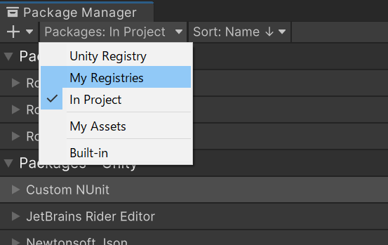
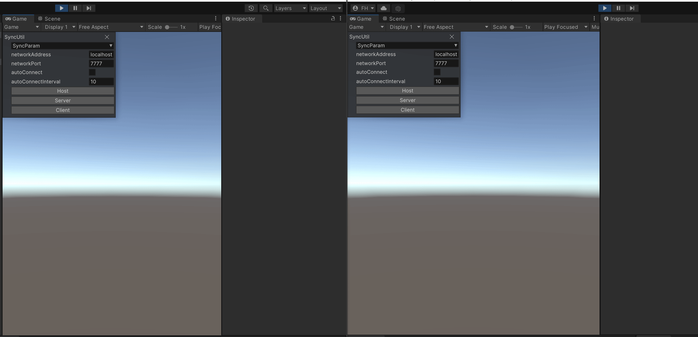
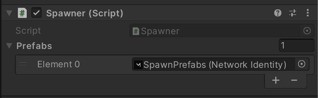
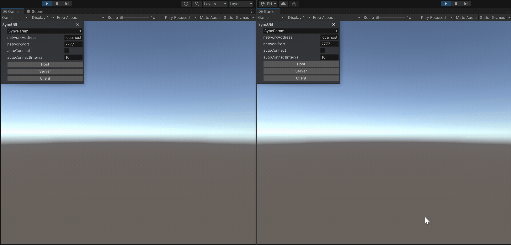
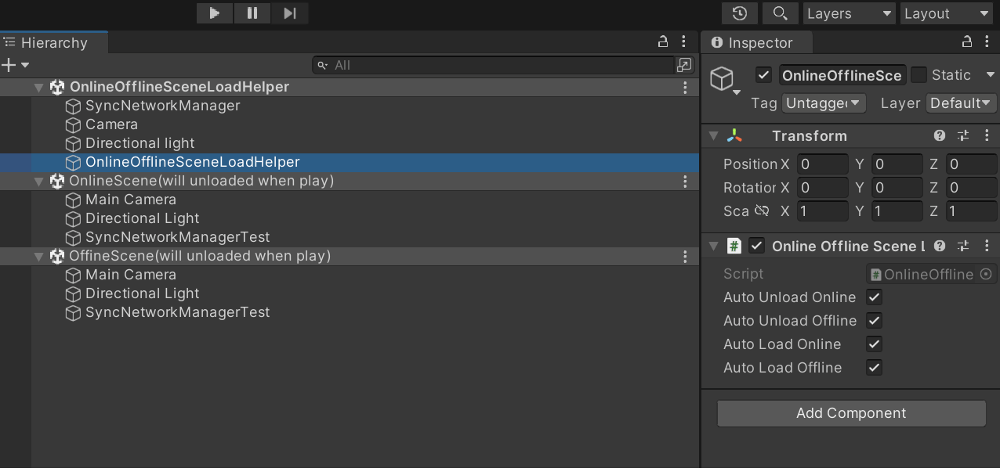

# SyncUtil For Mirror

[](https://badge.fury.io/js/ga.fuquna.syncutilformirror)
[](https://openupm.com/packages/ga.fuquna.syncutilformirror/)

Sync Utilities For [Mirror](https://github.com/vis2k/Mirror)  
  
# Installation

## Install Dependency
 - [Mirror via AssetStore](https://assetstore.unity.com/packages/tools/network/mirror-129321)


## Install package via scoped registory

**Edit > ProjectSettings... > Package Manager > Scoped Registries**

Enter the following and click the Save button.

```
"name": "fuqunaga",
"url": "https://registry.npmjs.com",
"scopes": [ "ga.fuquna" ]
```


**Window > Package Manager**

Select `MyRegistries` in `Packages:`



Select `SyncUtil For Mirror` and click the Install button
<!--  -->

# How to run Examples

1. Add all scene files(*.unity) to `Scenes In Build` of Build Settings.
1. Open and run *SyncUtilExamples.unity* scene. this is an example scene launcher.

# Functions

## SyncParam
Synchronization of member variables outside NetworkBeheivour.




## SyncBehaviourEnabled, SyncGameObjectActive


## InstanceRandom

Deterministic random per instance.


## LockStep

Deterministic LockStep framework.
- Chasing Playback
- Consistency Checker(Check for client out-of-sync)


*[Lorentz Attractor](https://en.wikipedia.org/wiki/Lorenz_system) implementation on CPU*


*[Conway's Game of Life](https://en.wikipedia.org/wiki/Conway%27s_Game_of_Life) implementation on GPU*


## Spawner

Spawn prefabs when the server is started.  
Register prefabs to NetworkManager's spawn prefabs.




## ServerOrStandAlone

Deactivate child GameObjects when server or standalone.

  
## ClientInvisibility

Specify the invisibility per Client to a GameObject.

  
## OnlineOfflineSceneLoadHelper

Load/Unload online/offline scene on hierarchy when application play.  



# References
- [RosettaUI](https://github.com/fuqunaga/RosettaUI) - Code-based GUI library for development menus for Unity
- [PrefsGUI](https://github.com/fuqunaga/PrefsGUI) - Accessors and GUIs for persistent preference values using a JSON file
- [PrefsGUISyncForMirror](https://github.com/fuqunaga/PrefsGUISyncForMirror) - Sync subset for PrefsGUI over Mirror
